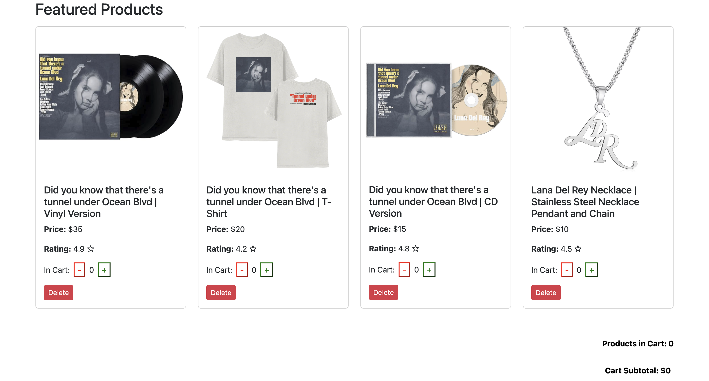
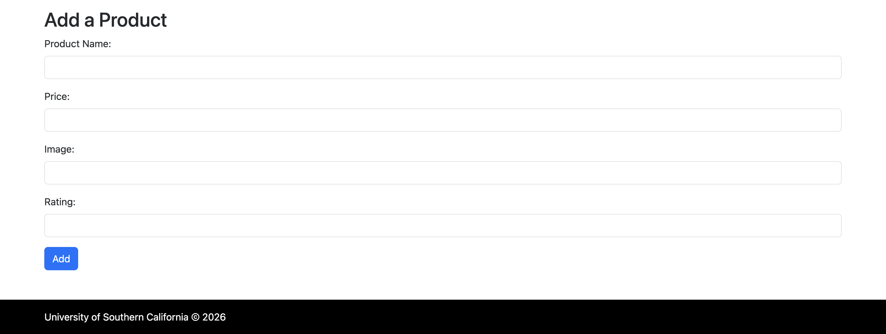

Website Link: [React E-Commerce Web Application](https://uscwebdev.github.io/tac303-submissions-davidd82/assignment_07/dist/index.html#products-featured)
# React E-Commerce Web Application

A responsive e-commerce web application built with **React** and **Vite** that allows users to browse products, manage a shopping cart, and dynamically add or remove products through an interactive user interface.

---

## Features

- Responsive React-based frontend
- Dynamic shopping cart functionality
- Real-time cart quantity and total price updates
- Add and remove products from the cart
- Create and delete products dynamically using forms
- Product rendering using JavaScript arrays and `.map()`
- Component-based architecture
- Custom CSS styling and responsive layout

---

## Technologies Used

- React
- JavaScript
- Vite
- HTML
- CSS

---

## Components

The application is divided into reusable React components including:

- Navigation Bar
- Header / Banner
- Featured Products Section
- Product Component
- Shopping Cart Summary
- Add Product Form
- Footer

---

## Shopping Cart Functionality

Users can:
- Add products to the cart
- Remove products from the cart
- View total cart quantity
- View total cart price

All cart values update dynamically using React state management.

---

## Product Management

Users can:
- Add new products using a form
- Delete existing products
- Dynamically render products from a JavaScript object array

Each product includes:
- Image
- Name
- Price
- Rating

---

## React Concepts Used

- Functional Components
- Props
- State Management (`useState`)
- Event Handling
- Controlled Forms
- Dynamic Rendering with `.map()`

---

## Screenshots

---

## Future Improvements

- Product search and filtering
- Persistent cart storage
- Backend integration
- User authentication
- Checkout functionality
- Product categories